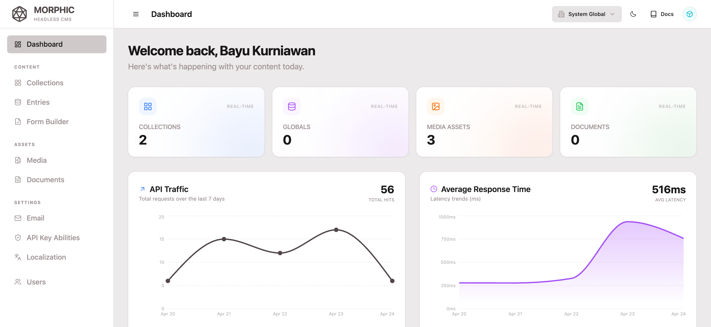

<div align="center">
  

# MORPHIC CMS

**The Edge-Ready, High-Performance Headless CMS for Modern Developers.**

🌐 [Official Website](https://morphic-cms.com) | 📖 [Documentation](https://morphic-cms.com/docs)

[](https://vercel.com/new/clone?repository-url=https%3A%2F%2Fgithub.com%2Fbayukurniawan30%2Fmorphic-cms&env=DATABASE_URL,JWT_SECRET,JWT_EXPIRES_IN_DAYS,STORAGE_SERVICE,CLOUDINARY_API_KEY,CLOUDINARY_API_SECRET,CLOUDINARY_CLOUD_NAME,CLOUDINARY_UPLOAD_PRESET,EMAIL_SERVICE,RESEND_API_KEY,EMAIL_FROM,SIMPLE_HOMEPAGE,CLOUDFLARE_TURNSTILE_SITE_KEY,CLOUDFLARE_TURNSTILE_SECRET_KEY,APP_DOMAIN)

_Built with Hono and Postgres JSONB to eliminate database schema friction entirely._

</div>

---

### 🚀 Why Morphic?

Morphic CMS isn't just another content manager. It's a lightweight, developer-first platform designed to run at the **Edge**. While other CMSs feel heavy and bloated, Morphic stays agile—leveraging a serverless-first stack that ensures your API is as fast as your content delivery network.

- **⚡ Blazing Fast**: Built on Hono, the ultra-lightweight web framework.
- **🧬 Zero-Migration Architecture**: Define fields dynamically in the UI. Morphic handles storage inside a single PostgreSQL JSONB column—no rigid table schemas or risky database migrations.
- **☁️ Serverless & Edge-Ready**: Perfect for Vercel, Cloudflare Workers, and Neon DB.
- **🎨 Premium UI**: A sleek, dark-themed dashboard that doesn't just work—it looks incredible.
- **🏗️ Developer Experience**: Type-safe with Drizzle ORM and built with the power of React + Inertia.js.

---

### ✨ Key Features

- **🌐 Multi-tenant Architecture**: Scale your SaaS easily. Manage isolated organizations and workspaces from a single instance.
- **🛠️ Dynamic Schema Builder**: Define custom collections and global settings with a powerful, intuitive field system.
- **📁 Smart Media Management**: Seamlessly integrated Cloudinary support with automatic, tenant-based organization.
- **📋 Public Forms & Custom Branding**: Publish beautiful public questionnaires/forms directly from internal collections with custom header images, footer texts, and 8 theme color presets.
- **🛡️ Bot Mitigation & Rate Limiting**: Out-of-the-box integration with Cloudflare Turnstile and IP-based rate limiting to prevent spam submissions.
- **🔒 Secure by Design**: Tenant-scoped REST API with JWT authentication and granular API Key permissions.
- **🌍 Built-in i18n**: Native multi-language support for global content strategies.
- **📊 Real-time Analytics**: Built-in API usage tracking and performance monitoring out of the box.

---

### 📋 Public Forms & Security (Cloudflare Turnstile)

Morphic CMS lets you publish collection schemas as public forms. You can brand them with customized header images (integrated with media manager), custom titles/footers, and 8 curated HSL color themes (`slate`, `emerald`, `blue`, `indigo`, `violet`, `rose`, `orange`, `yellow`).

#### Form Status Control
Each public form can be turned online or offline instantly:
- **Active Toggle**: Control form availability via the **"Status: Open for submissions"** switch in the dashboard.
- **Closed Screen**: When toggled off, visitors are greeted with a premium restricted/closed screen, and the API rejects any programmatic submits.

#### Bot Mitigation Setup
To protect your public forms from spam, Morphic integrates Cloudflare Turnstile:
1. Register your site on [Cloudflare Turnstile](https://www.cloudflare.com/products/turnstile/).
2. Add the site key and secret key to your `.env` file:
   ```env
   CLOUDFLARE_TURNSTILE_SITE_KEY=your_turnstile_site_key
   CLOUDFLARE_TURNSTILE_SECRET_KEY=your_turnstile_secret_key
   ```
3. **Local Dev Bypass**: Turnstile challenges and origin validation are automatically bypassed when testing on `localhost` or `127.0.0.1` for local developer convenience.
4. **IP Rate Limiting**: Form submissions are protected by a built-in rate limiter (max 5 submissions per 15 minutes per IP per form).

---

### 🌐 Multi-Tenant Subdomain Routing

Morphic CMS supports isolated multi-tenant routing using subdomains (e.g. `tenant-slug.yourdomain.com`). 

To configure subdomains for your custom domain:
1. In Vercel or your hosting provider, add a wildcard domain mapping (e.g., `*.yourdomain.com`).
2. Add the `APP_DOMAIN` environment variable in your `.env` file:
   ```env
   APP_DOMAIN=yourdomain.com
   ```
If `APP_DOMAIN` is not set, it defaults to `morphic-cms.com`.

*Note: For local development, subdomain redirects are automatically bypassed when accessing raw `localhost` to avoid browser cookie domain restrictions.*

---

### 🛠️ The "Edge-First" Tech Stack

Morphic leverages the most cutting-edge tools in the ecosystem:

| Layer        | Technology                               | Why?                                                           |
| ------------ | ---------------------------------------- | -------------------------------------------------------------- |
| **Core**     | [Hono](https://hono.dev/)                | Sub-millisecond overhead, runs on any runtime.                 |
| **Database** | [Neon PostgreSQL](https://neon.tech/)    | Serverless, autoscaling, and perfect for ultra-fast JSONB document queries. |
| **ORM**      | [Drizzle ORM](https://orm.drizzle.team/) | TypeScript-first, zero-runtime overhead.                       |
| **Bridge**   | [Inertia.js](https://inertiajs.com/)     | The feel of an SPA with the simplicity of server-side routing. |
| **Styling**  | [Tailwind CSS](https://tailwindcss.com/) | Rapid, beautiful, utility-first design.                        |

---

### 📦 Quick Start

#### One-Click Deploy

The fastest way to get Morphic running is to click the **Deploy with Vercel** button above. It will set up your repository, environment variables, and initial deployment in seconds.

#### Local Development

1. **Clone & Install**:

   ```bash
   git clone https://github.com/bayukurniawan30/morphic-cms.git
   cd morphic-cms
   pnpm install
   ```

2. **Configure Environment**:
   Copy `.env.example` to `.env` and fill in your database, Cloudinary, and optional `SIMPLE_HOMEPAGE` and `APP_DOMAIN` settings.

3. **Database Setup**:

   ```bash
   pnpm run db:push    # Push schema to Neon
   pnpm run db:seed    # Seed initial admin user
   ```

4. **Run**:
   ```bash
   pnpm run dev
   ```

---

### 🚀 Deployment

#### 🐳 Deploying with Docker (VPS Setup)

Morphic CMS includes a fully configured `Dockerfile` and `docker-compose.yml` for easy deployment to any VPS (DigitalOcean, Hetzner, AWS EC2, etc.).

1. **Clone the repository on your server**:
   ```bash
   git clone https://github.com/bayukurniawan30/morphic-cms.git
   cd morphic-cms
   ```

2. **Configure Environment**:
   Open `docker-compose.yml` and set up your Cloudinary credentials under the `environment` section.

3. **Start the containers**:
   ```bash
   docker compose up -d
   ```

4. **Initialize the Database**:
   You need to push the schema to your new local PostgreSQL container:
   ```bash
   docker compose exec morphic pnpm run db:push
   docker compose exec morphic pnpm run db:seed
   ```

Your CMS is now running on `http://your-server-ip:3000`. We recommend putting it behind an Nginx reverse proxy with SSL (e.g., using Certbot).

#### ☁️ Deploying to AWS (Serverless)

For an enterprise-grade setup entirely on AWS, you can utilize a true Serverless architecture using AWS Lambda, S3, CloudFront, and Amazon RDS.

1. **Database (Amazon Aurora)**: 
   Provision an **Amazon Aurora Serverless v2 (PostgreSQL)** database. Copy the connection string and set it as your `DATABASE_URL`.
2. **API (AWS Lambda)**: 
   Morphic is built on Hono, which has first-class AWS Lambda support. 
   - Install the adapter: `pnpm add hono/aws-lambda`
   - Create a Lambda entry point (`lambda.ts`) using the `handle` function from `hono/aws-lambda` wrapping the app from `src/api/index.ts`.
   - Deploy this function using AWS SAM, CDK, or Serverless Framework.
3. **Static Assets (Amazon S3 + CloudFront)**:
   - Build the frontend: `pnpm run build`
   - Upload the contents of the `./dist` folder to an Amazon S3 bucket.
   - Put an Amazon CloudFront distribution in front of your S3 bucket to serve static assets globally. Ensure CloudFront is configured to route `/api/*` and non-asset requests back to your Lambda function URL or API Gateway.
4. **Email (Amazon SES vs Resend)**:
   Morphic supports both Resend (default) and Amazon SES out-of-the-box. To use SES for a 100% AWS-native stack, simply set `EMAIL_SERVICE=SES` in your environment variables and provide your AWS credentials (`AWS_REGION`, `AWS_ACCESS_KEY_ID`, `AWS_SECRET_ACCESS_KEY`).
5. **Storage (Amazon S3 vs Cloudinary)**:
   Morphic supports both Cloudinary (default) and Amazon S3. To use S3 for a 100% AWS-native stack, set `STORAGE_SERVICE=S3` and provide your AWS credentials as well as `AWS_S3_BUCKET`. Make sure your bucket allows public read access.

---

### 🤝 Contributing

We love stars! ⭐ If you find Morphic useful, please give it a star on GitHub to help others find it.

Morphic is an open-source project. Feel free to open issues or submit PRs to help us build the fastest CMS on the web.

---

<div align="center">
  <p>Made with ❤️ by <b>Bayu Kurniawan</b></p>
</div>
